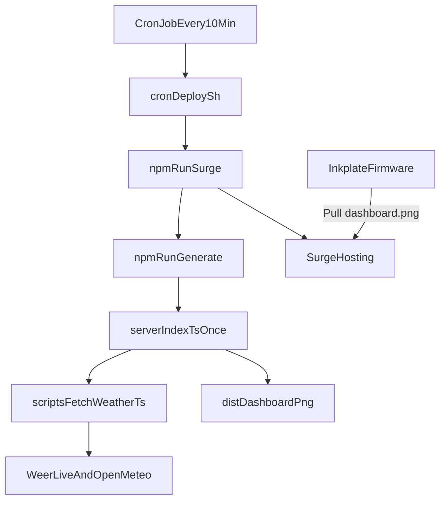

# Architecture and CRON Deployment

This document describes how screenshot generation and deployment work, and how to run them every 10 minutes on a Raspberry Pi.

## Goals

- Keep `dist/dashboard.png` fresh for the Inkplate display.
- Deploy updated static output to Surge on a fixed schedule.
- Keep setup simple: Linux CRON triggers a local script.

## Current Runtime Components

- Dashboard and weather build pipeline in `scripts/fetchWeather.ts` and Vite build scripts from `package.json`.
- Screenshot generation server in `server/index.ts` (`npm run generate` via `--once`).
- Deployment command in `package.json`: `npm run surge` runs generation + `surge dist/ ...`.
- New CRON entrypoint in `cron/deploy.sh` for Raspberry Pi scheduling.

## End-to-End Flow



## CRON Setup on Raspberry Pi

1. Clone this repo on the Pi and run `npm install`.
2. Ensure Surge auth is configured once on the Pi (so `surge` can publish non-interactively).
3. Add CRON entry using `crontab -e`:

```cron
*/10 * * * * /home/pi/inkplate/cron/deploy.sh >> /home/pi/inkplate/cron/deploy.log 2>&1
```

4. Verify with:
   - `tail -f /home/pi/inkplate/cron/deploy.log`
   - Check that `dashboard.png` on your Surge domain updates every 10 minutes.

## Why CRON Script Instead of Long-Running Scheduler

- Better fit for Raspberry Pi operations: restart-safe and easy to inspect.
- No always-on Node process needed only for scheduling.
- Scheduling remains declarative in `crontab`.

## Operational Notes

- `cron/deploy.sh` sets a broader `PATH` because CRON starts with a minimal environment.
- Script runs from project root to ensure `npm run surge` resolves local project config.
- If one run can exceed 10 minutes, add a lock strategy later (for example `flock`) to avoid overlap.
